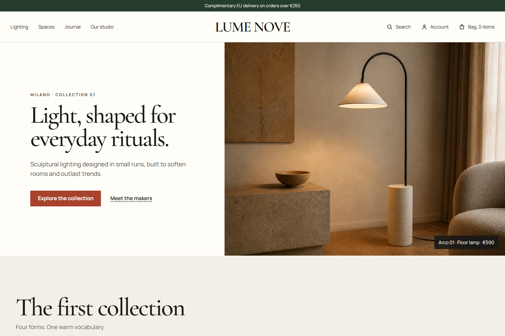

# LUME NOVE — Accessible Premium Commerce

[](https://github.com/kalil-tg/lume-nove-accessible-commerce/actions/workflows/quality.yml)


LUME NOVE is a self-initiated, production-style accessibility engineering case study for a fictional European lighting brand. It demonstrates how a premium React storefront can preserve its visual identity while improving keyboard access, form semantics, focus management, error recovery, responsive behavior, and automated regression coverage.



This is not a client project, legal certification, or claim of European Accessibility Act compliance. The brand, products, addresses, and commerce data are fictional and disclosed as such in the interface.

## What this project proves

- A complete commerce journey: storefront, filters, product configuration, modal cart, and delivery checkout.
- WCAG 2.2 AA-oriented implementation patterns rather than a scanner-only report.
- A controlled legacy checkout fixture with known failures and a separate remediated application.
- Automated axe scans across the storefront, product page, open cart dialog, checkout, and 390px mobile state.
- Keyboard regression checks for the skip link, modal focus, Escape behavior, focus return, and error-summary navigation.
- Premium responsive design with no runtime AI, analytics tracker, paid API, or backend dependency.

## Routes

- `/` — storefront and working product filters.
- `/products/arco-01` — product configuration, gallery, accordions, quantity control, and modal cart.
- `/checkout` — delivery form, validation, error summary, and order summary.
- `audit/fixtures/legacy-checkout.html` — intentionally inaccessible test fixture; excluded from the production route tree.

## Run locally

```bash
pnpm install
pnpm dev
```

Open `http://127.0.0.1:4173/`.

## Quality gates

```bash
pnpm typecheck
pnpm lint
pnpm build
pnpm test:e2e
```

The last verified run produced:

- TypeScript: pass.
- ESLint: pass with zero warnings.
- Production build: pass.
- Playwright: 6/6 tests passing.
- axe-core: zero detected violations in the five remediated states under the configured WCAG A/AA tags.
- Controlled baseline: five automated violation families retained intentionally for comparison.

Automated tools cannot determine accessibility on their own. See [the audit report](docs/ACCESSIBILITY_AUDIT.md) and [manual test plan](docs/MANUAL_QA_PLAN.md) for the tested scope and remaining work.

## Performance snapshot

- Six production images: 13,071,233 bytes of source PNGs reduced to 615,326 bytes of WebP delivery assets, a 95.3% reduction.
- Production output: 1,148,948 bytes across 21 files in the verified build.
- Application JavaScript: 82.18kB gzip.
- Application CSS: 6.48kB gzip.
- Fonts and imagery are local; no third-party request is required to render the experience.

Original high-resolution PNGs remain in `design/source-assets/`. Optimized WebP files are served from `public/images/`.

## Accessibility implementation highlights

- Semantic landmarks and a keyboard-visible skip link.
- Persistent visible labels, fieldsets, legends, autocomplete tokens, and native inputs.
- Error summary receives focus, links to the invalid field, and mirrors inline guidance through `aria-invalid` and `aria-describedby`.
- Native modal dialog with an accessible heading, Escape support, focus containment, and focus return.
- Text-backed product finishes and status messages that do not rely on color alone.
- Named controls with minimum target sizing and strong `:focus-visible` treatment.
- Reduced-motion fallback and responsive layouts with no horizontal overflow at the tested 390px and 1440px viewports.

## Documentation

- [Portfolio case study](docs/CASE_STUDY.md)
- [Accessibility audit](docs/ACCESSIBILITY_AUDIT.md)
- [Manual QA plan](docs/MANUAL_QA_PLAN.md)
- [Product Rescue evidence capsule](docs/EVIDENCE_CAPSULE_PRODUCT_RESCUE.md)
- [Contra-ready project copy](docs/CONTRA_PROJECT_COPY.md)
- [Visual fidelity ledger](docs/FIDELITY_LEDGER.md)
- [Image-generation prompts](design/IMAGEGEN_PROMPTS.md)

## Technical positioning

The implementation targets WCAG 2.2 AA technical criteria and common EAA-facing e-commerce risks. It does not provide legal advice or guarantee statutory compliance. Human testing with assistive technology remains necessary before any production compliance claim.

Authoritative references:

- [W3C WCAG 2.2](https://www.w3.org/TR/WCAG22/)
- [W3C guidance on selecting evaluation tools](https://www.w3.org/WAI/test-evaluate/tools/selecting/)
- [European Commission overview of the European Accessibility Act](https://commission.europa.eu/strategy-and-policy/policies/justice-and-fundamental-rights/disability/european-accessibility-act-eaa_en)

## Portfolio

[View the published LUME NOVE case study on Contra](https://contra.com/p/7Zlgr6Oc-lume-nove-accessible-e-commerce-engineering-case-study)
